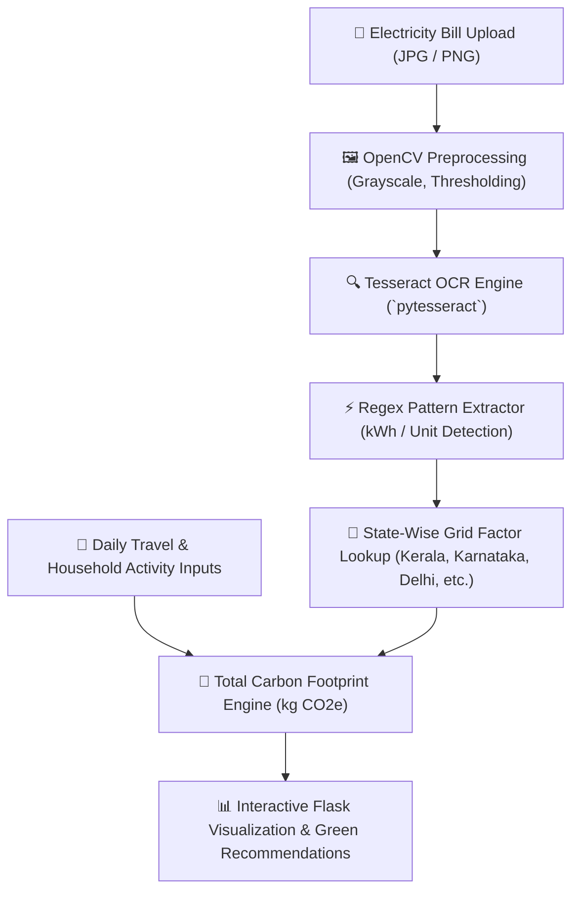

# 🌍 Smart Carbon Footprint Tracker & Electricity Bill OCR Scanner

<div align="center">

[](https://python.org)
[](https://flask.palletsprojects.com/)
[](https://github.com/tesseract-ocr/tesseract)
[](https://opencv.org/)
[](LICENSE)

**An intelligent sustainability web application that computes individual carbon footprints, estimates regional grid emissions, and automatically extracts electricity consumption from utility bills using Optical Character Recognition (OCR).**

</div>

---

## 📌 Overview

The **Carbon Footprint Tracker** empowers individuals and households to assess, understand, and reduce their greenhouse gas emissions ($CO_2e$). 

Beyond standard manual emission calculators, the application features an **automated Computer Vision & OCR pipeline** that scans photographed or uploaded electricity bills to detect kWh consumption figures and cross-references them against **state-specific power grid emission factors across India**.

---

## 🏗️ System Workflow



---

## 🚀 Key Features

- **📷 Automated Electricity Bill OCR**:
  - Direct photo/scan upload of electricity utility statements.
  - Employs **Tesseract OCR** and **OpenCV** with robust regex heuristics to isolate `kWh` and `units` without requiring manual entry.
- **⚡ Indian State-Specific Grid Emission Modeling**:
  - Calculates precise emissions based on regional energy generation mixes:
    | State | Factor ($kg\ CO_2 / kWh$) | State | Factor ($kg\ CO_2 / kWh$) |
    | :--- | :--- | :--- | :--- |
    | **Himachal Pradesh** | 0.30 (Hydro dominant) | **Gujarat** | 0.82 |
    | **Kerala** | 0.55 | **Delhi** | 0.85 |
    | **Karnataka** | 0.72 | **Maharashtra** | 0.90 |
    | **Tamil Nadu** | 0.75 | **West Bengal** | 0.95 |
    | **Jharkhand** | 1.05 (Thermal dominant) | — | — |
- **🚗 Multi-Modal Activity Emission Estimator**:
  - Factors in personal transportation (petrol/diesel vehicles, two-wheelers, public transit).
  - LPG cylinder usage and household solid waste impact.
- **💡 Actionable Mitigation Recommendations**:
  - Suggests targeted energy conservation tactics, solar transition ROI, and personalized behavioral changes.

---

## 📂 Repository Structure

```bash
carbon-footprint-tracker/
├── app.py              # Flask server, OCR parsing logic & calculation engine
├── requirements.txt    # Python dependencies (flask, pytesseract, opencv, pillow)
├── templates/          # Jinja2 HTML templates
│   ├── index.html      # Primary input & bill scanner form
│   └── result.html     # Comprehensive emission score & breakdown dashboard
└── README.md
```

---

## 🛠️ Quickstart Guide

### 1. Prerequisites
- Python 3.9+
- **Tesseract OCR Engine** installed on your system:
  - **Windows**: Download from [UB-Mannheim](https://github.com/UB-Mannheim/tesseract/wiki) and ensure path points to `C:\Program Files\Tesseract-OCR\tesseract.exe`.
  - **Linux / Ubuntu**: `sudo apt install tesseract-ocr libtesseract-dev`
  - **macOS**: `brew install tesseract`

### 2. Installation

```bash
# Clone the repository
git clone https://github.com/Manukrishna1971/carbon-footprint-tracker.git
cd carbon-footprint-tracker

# Create virtual environment
python -m venv venv
source venv/bin/activate  # On Windows: .\venv\Scripts\activate

# Install dependencies
pip install -r requirements.txt
```

### 3. Run Application

```bash
python app.py
```
Open **[http://localhost:5000](http://localhost:5000)** in your browser.

---

## 📊 Emission Calculation Methodology

$$\text{Electricity Emissions } (kg\ CO_2) = \text{Units Consumed } (kWh) \times \text{State Grid Factor}$$

$$\text{Total Annual Footprint } = \text{Electricity} + \text{Commute} + \text{LPG Consumption} + \text{Waste Factor}$$

---

## 📄 License

Distributed under the **MIT License**. Created by [Manukrishna](https://github.com/Manukrishna1971).
